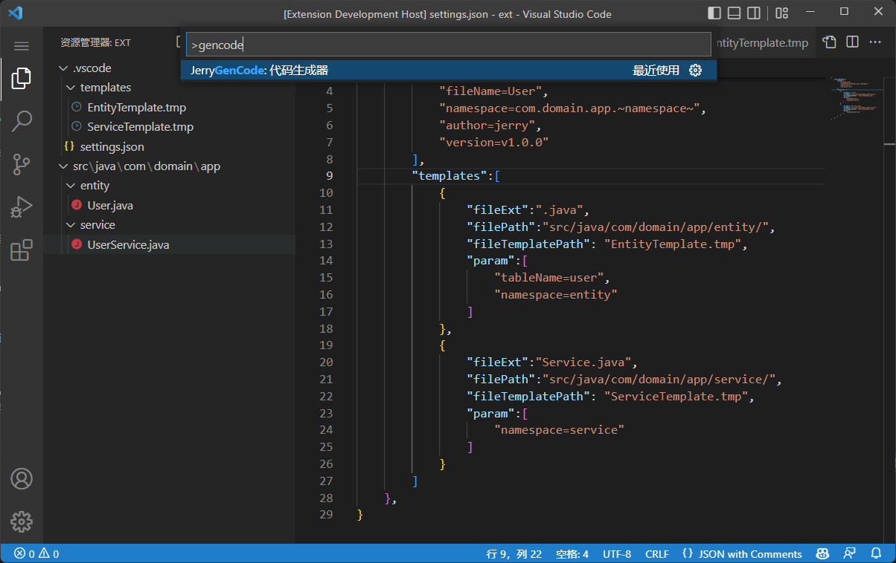
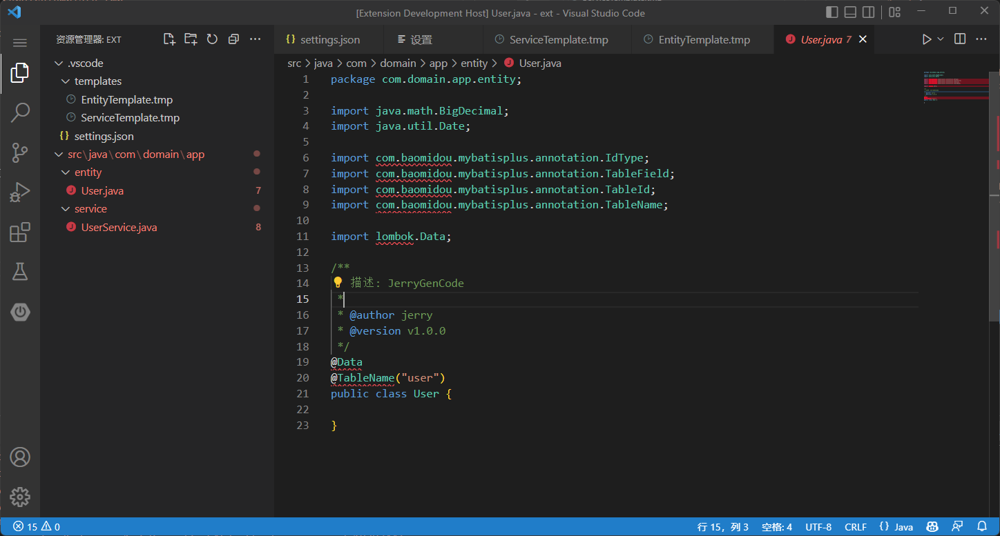

# JerryGenCode
一个灵活配置的代码生成器vscode扩展插件

# 用法
## 1 文件模板添加
在.vscode/templates/添加模板文件内容如下:
```java
package ~namespace~;

import java.math.BigDecimal;
import java.util.Date;

import com.baomidou.mybatisplus.annotation.IdType;
import com.baomidou.mybatisplus.annotation.TableField;
import com.baomidou.mybatisplus.annotation.TableId;
import com.baomidou.mybatisplus.annotation.TableName;

import lombok.Data;

/**
 * 描述: JerryGenCode
 *
 * @author ~author~
 * @version ~version~
 */
@Data
@TableName("~tableName~")
public class ~fileName~ {

}

```

## 2 配置
创建.vscode目录，并添加settings.json,输入以下json
```json
{
    "JerryGenCode":{
        //全局参数配置
        "param":[
            "fileName=User", //文件的名称(必要)
            "namespace=com.domain.app.~namespace~",
            "author=jerry",
            "version=v1.0.0"
        ],
        //生成模板配置
        "templates":[
            {
                "fileExt":".java", //文件的名称后缀(必要)
                "filePath":"src/java/com/domain/app/entity/",//文件的名称后缀(必要)
                "fileTemplatePath": "EntityTemplate.tmp", //模板名称,路径（.vscode/templates/）(必要)
                "param":[
                    "tableName=user",
                    "namespace=entity"
                ]
            },
            {
                "fileExt":"Service.java",
                "filePath":"src/java/com/domain/app/service/",
                "fileTemplatePath": "ServiceTemplate.tmp",
                "param":[
                    "namespace=service"
                ]
            }
        ]
    },
}
```

## 3 运行生成
按 F1 或 Ctrl + Shift + P 打开命令窗口，输入jerryGenCode如图：



## 4 效果


